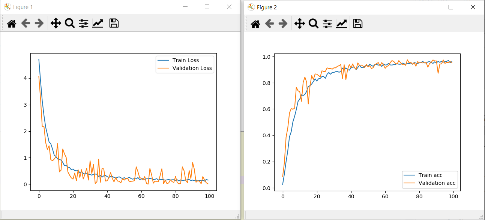

# Python-Fruits-360-CNN
</img>

<strong>Fruits Detection using CNN model.</strong>

Dataset used :

<strong>Fruits 360</strong>

A dataset of images consists of various fruits and vegetables.

<strong>About Dataset</strong>
<ul>
<li>Total number of images: 90483.</li>

<li>Training set size: 67692 images (one fruit or vegetable per image).</li>

<li>Test set size: 22688 images (one fruit or vegetable per image).</li>

<li>Multi-fruits set size: 103 images (more than one fruit (or fruit class) per image).</li>

<li>Number of classes: 131 (fruits and vegetables).</li>

<li>Image size: 100x100 pixels.</li>
</ul>

You can have this dataset from <a href="https://www.kaggle.com/moltean/fruits">Kaggle</a>.
